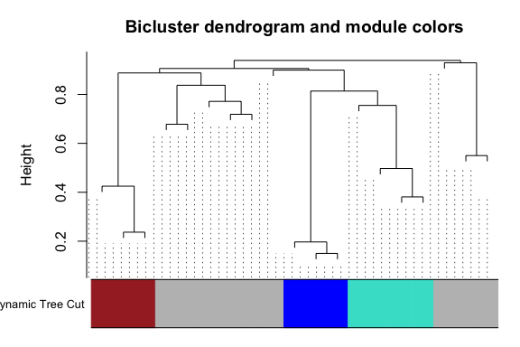
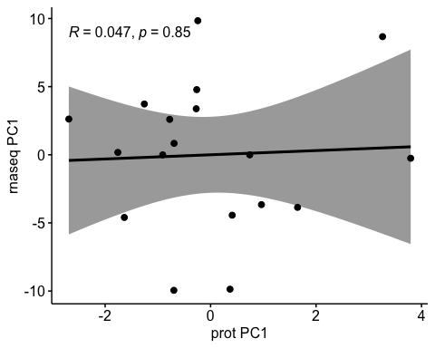
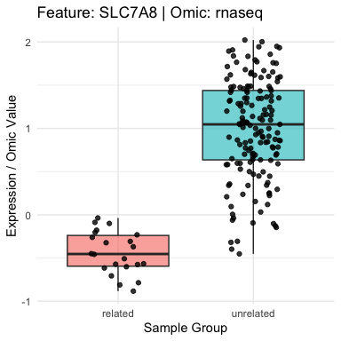
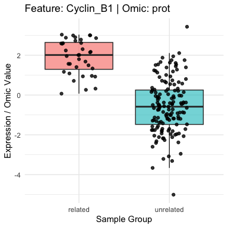

MOBAA is an R-based tool for discovering biologically meaningful
subgroups within a population using multi-omics data. The method applies
biclustering independently to each omics dataset (e.g., gene expression,
protein abundance, DNA methylation) to detect locally coherent patterns
of features and samples. It then integrates these biclusters across omic
layers by quantifying sample overlap with the Jaccard index, grouping
them into bicluster modules. Within each module, MOBAA identifies
multi-omic relations, sets of biclusters from different omics that share
the largest sample overlap, and tests their statistical significance
using permutation-based methods. The resulting subgroups represent
coherent, multi-layered molecular profiles that may correspond to
disease subtypes, phenotypes, or other biologically relevant states.
MOBAA also provides downstream analyses, including phenotype enrichment,
inter-omics correlation, differential feature analysis, and pathway
enrichment. Unlike many existing tools that integrate only two omics
types, MOBAA is scalable to handle multiple omic layers simultaneously.
This makes it a powerful framework for uncovering complex biological
heterogeneity and advancing precision medicine research.

## Example Workflow Using TCGA-BRCA Data
(This tutorial is also available as html page - https://raw.githack.com/pmishra912/MOBAA/main/vignettes/tutorial.html)

In this tutorial, we demonstrate how to use MOBAA with a multi-omic
dataset from TCGA-BRCA. We’ll retrieve gene expression, methylation, and
protein abundance data, and walk through the steps of biclustering,
multi-omic integration and downstream analyses.

We begin by loading the necessary packages and downloading the BRCA
dataset from TCGA. This includes RNA sequencing, methylation, and
protein expression data.

> This step may take a few minutes depending on your internet speed and
> disk space.

    library(curatedTCGAData)
    library(MultiAssayExperiment)

    ## Download BRCA dataset for this example analysis 
    availableTCGA <- curatedTCGAData(dry.run = TRUE,version = "2.1.1")

    brca_multi <- curatedTCGAData(
      diseaseCode = "BRCA",
      assays = c("RNASeq2GeneNorm", "Methylation_methyl450", "RPPAArray"),
      version = "2.1.1",
      dry.run = FALSE
    )

    rnaseq <- assays(brca_multi)[["BRCA_RNASeq2GeneNorm-20160128"]] 
    rnaseq <- na.omit(rnaseq) 

    prot <- assays(brca_multi)[["BRCA_RPPAArray-20160128"]]
    prot <- na.omit(prot) 

    meth <- as.matrix(assays(brca_multi)[["BRCA_Methylation_methyl450-20160128"]])
    meth <- na.omit(meth)

    clinical_data <- colData(brca_multi)
    table(clinical_data$PAM50.mRNA)

    # keep only those patients who have BRCA subtype info
    clinical_data <- clinical_data[complete.cases(clinical_data$PAM50.mRNA), ] 
    table(clinical_data$PAM50.mRNA)

Prepare data for mobaa

    # extract patient IDs (the first 12 characters),
    colnames(rnaseq) <- substr(colnames(rnaseq), 1, 12)
    colnames(meth) <- substr(colnames(meth), 1, 12)
    colnames(prot) <- substr(colnames(prot), 1, 12)

    common.patients <- Reduce(intersect, list(colnames(rnaseq),colnames(meth), colnames(prot), clinical_data$patientID)) # 641
    rnaseq_final <- rnaseq[,match(common.patients,colnames(rnaseq))]
    meth_final <- meth[,match(common.patients,colnames(meth))]
    prot_final <- prot[,match(common.patients,colnames(prot))]
    clinical_final <- clinical_data[match(common.patients,clinical_data$patientID),]
    clinical_final$patientID==colnames(rnaseq_final)
    clinical_final$patientID==colnames(prot_final)
    clinical_final$sampleID <- clinical_final$patientID # for the mobaa code to recognize
    table(clinical_final$PAM50.mRNA)

    # Keep only the 20000 most variable CpGs in the methylation data
    row_vars <- apply(meth_final, 1, var, na.rm = TRUE)
    top_var_indices <- order(row_vars, decreasing = TRUE)[1:20000]
    meth_top20k <- as.matrix(meth_final[top_var_indices, ])

    # standardize the data
    # Adapted from:
    # Rose, T. D. (2025). Example workflow (mosbi package vignette, Bioconductor).
    # Retrieved April 15, 2025, from https://bioconductor.org/packages/devel/bioc/vignettes/mosbi/inst/doc/example-workflow.html

    z_score <- function(x, margin = 2) {
        z_fun <- function(y) {
            (y - mean(y, na.rm = TRUE)) / sd(y, na.rm = TRUE)
        }
        if (margin == 2) {
            apply(x, margin, z_fun)
        } else if (margin == 1) {
            t(apply(x, margin, z_fun))
        }
    }

    rnaseq_zscore <- z_score(rnaseq_final)
    prot_zscore <- z_score(prot_final)
    dim(rnaseq_zscore)

    ## [1] 12652   179

    dim(prot_zscore)

    ## [1] 216 179

    dim(meth_top20k)

    ## [1] 20000   179

Install mobaa R package directly from github

    remotes::install_github("pmishra912/MOBAA")

    ## pillar (1.11.0 -> 1.11.1) [CRAN]

    ## 
    ## The downloaded binary packages are in
    ##  /var/folders/23/3qtzvb3j5j34p0slc1_jk3y00000gr/T//Rtmp49iAhW/downloaded_packages
    ## ── R CMD build ─────────────────────────────────────────────────────────────────
    ##      checking for file ‘/private/var/folders/23/3qtzvb3j5j34p0slc1_jk3y00000gr/T/Rtmp49iAhW/remotes5cc33ea3f926/pmishra912-MOBAA-afba82c/DESCRIPTION’ ...  ✔  checking for file ‘/private/var/folders/23/3qtzvb3j5j34p0slc1_jk3y00000gr/T/Rtmp49iAhW/remotes5cc33ea3f926/pmishra912-MOBAA-afba82c/DESCRIPTION’
    ##   ─  preparing ‘mobaa’:
    ##      checking DESCRIPTION meta-information ...  ✔  checking DESCRIPTION meta-information
    ##   ─  checking for LF line-endings in source and make files and shell scripts
    ##   ─  checking for empty or unneeded directories
    ##   ─  building ‘mobaa_0.1.0.tar.gz’
    ##      
    ## 

    library(mobaa)

Or, install from local zip file provided in release/

    remotes::install_local("mobaa.zip")
    library(mobaa)

Run ensembel biclustering using a wrapper function for mosbi

    prot_ensemble_bicluster_list <- find_ensemble_bc(
      prot_zscore,methods = c("fabia", "qubic"),
      seed = 1111
      )

    ## Esimated cut-off:  0.005005005

    rnaseq_ensemble_bicluster_list <- find_ensemble_bc(
      rnaseq_zscore,methods = c("fabia", "qubic"),
      seed = 2222
      )

    ## Esimated cut-off:  0.001001001

    meth_ensemble_bicluster_list <- find_ensemble_bc(
      meth_top20k,methods = c("fabia", "qubic"),
      seed = 3333
      )

    ## Esimated cut-off:  0.002002002

Calculate Jaccard distance among the biclusters

    bc_dist_res <- generate_jaccard_dist(
      mosbi_outputs=list(prot_ensemble_bicluster_list,rnaseq_ensemble_bicluster_list,meth_ensemble_bicluster_list),
      omic_names=c("prot","rnaseq","meth"),
      omic_data=list(prot_zscore,rnaseq_zscore,meth_top20k)
      )

Hierarchical clustering of biclusters across different omics

    bc_module_res <- hclust_bcs(bc_dist_res[[1]],plots=TRUE)

    ##  ..done.

    # identified bicluster modules, named as colours.
    bc_module_res$multiomic_modules

    ## $grey
    ## [1] "prot_1"   "prot_2"   "prot_3"   "prot_4"   "prot_5"   "prot_7"   "prot_8"  
    ## [8] "rnaseq_2" "rnaseq_7"
    ## 
    ## $turquoise
    ## [1] "prot_6"   "rnaseq_1" "rnaseq_3" "meth_2"

Find the best multi-omic relation. For example, the grey bicluster
module contains 4 proteomic biclusters and 2 rnaseq biclusters. The
‘find\_relations’ function selects the best proteomic-rnaseq bicluster
pair (relation) with maximum sample overlap.

    # grey relation
    grey_relation <- find_relations(
      biclusters_list=list(prot=prot_ensemble_bicluster_list,rnaseq=rnaseq_ensemble_bicluster_list),
      module="grey",
      pheno=clinical_final,
      bc_dist_obj=bc_dist_res,
      bc_hclust_obj=bc_module_res
      )

    # turquoise relation
    turquoise_relation <- find_relations(
      biclusters_list=list( meth=meth_ensemble_bicluster_list,rnaseq=rnaseq_ensemble_bicluster_list,prot=prot_ensemble_bicluster_list),
      module="turquoise",
      pheno=clinical_final,
      bc_dist_obj=bc_dist_res,
      bc_hclust_obj=bc_module_res
      )

How many patients are present in all the biclusters in each of the
relations (patient overlap)?

    # grey
    patients_overlap_grey <- Reduce(intersect, grey_relation$sample_ids)
    length(patients_overlap_grey) 

    ## [1] 18

    # turquouse
    patients_overlap_turquoise <- Reduce(intersect, turquoise_relation$sample_ids)
    length(patients_overlap_turquoise) 

    ## [1] 62

Are the shared number of patients across biclusters in the relations
statistically significant?

    # grey
    perm.overlap.sig(grey_relation$sample_ids,clinical_final$sampleID) 

    ## [1] 1e-04

    # turquouse
    perm.overlap.sig(turquoise_relation$sample_ids,clinical_final$sampleID) 

    ## [1] 0.7839

Check number of overlapped patients across different subtypes.

    sum(patients_overlap_grey %in% clinical_final$sampleID[clinical_final$PAM50.mRNA=="Basal-like"]) 

    ## [1] 18

    sum(patients_overlap_grey %in% clinical_final$sampleID[clinical_final$PAM50.mRNA=="HER2-enriched"])

    ## [1] 0

    sum(patients_overlap_grey %in% clinical_final$sampleID[clinical_final$PAM50.mRNA=="Luminal A"])

    ## [1] 0

    sum(patients_overlap_grey %in% clinical_final$sampleID[clinical_final$PAM50.mRNA=="Luminal B"])

    ## [1] 0

    sum(patients_overlap_grey %in% clinical_final$sampleID[clinical_final$PAM50.mRNA=="Normal-like"])

    ## [1] 0

> The participant overlap (n=22) is statistically significant in grey
> relation but not in turquoise. Also, all of the participants who are
> present in all the biclusters in grey relation (overlap) belong to
> ‘Basal-like’ subtype. Therefore, lets continue analyzing grey relation
> further.

Check patient distribution across different subtypes in the whole data

    table(clinical_final$PAM50.mRNA)

    ## 
    ##    Basal-like HER2-enriched     Luminal A     Luminal B   Normal-like 
    ##            39            12            85            38             5

Is the proportion of patients with subtype ‘Basal-like’ in the grey
relation greater than the background proportion?

    prop.test(x = 22, n = 22, p = 39/179, alternative = "greater")

    ## 
    ##  1-sample proportions test with continuity correction
    ## 
    ## data:  22 out of 22, null probability 39/179
    ## X-squared = 74.451, df = 1, p-value < 2.2e-16
    ## alternative hypothesis: true p is greater than 0.2178771
    ## 95 percent confidence interval:
    ##  0.8531437 1.0000000
    ## sample estimates:
    ## p 
    ## 1

    ## or, in case of lower sample size, binom.test is the exact test and preferred
    binom.test(x = 22, n = 22, p = 39/179, alternative = "greater")

    ## 
    ##  Exact binomial test
    ## 
    ## data:  22 and 22
    ## number of successes = 22, number of trials = 22, p-value = 2.758e-15
    ## alternative hypothesis: true probability of success is greater than 0.2178771
    ## 95 percent confidence interval:
    ##  0.8726946 1.0000000
    ## sample estimates:
    ## probability of success 
    ##                      1

Summary level (eigenfeatures) correlation between different omics in the
grey relation.

    corr_result <- correlate_eigenfeatures(
      omic_list = list(rnaseq = rnaseq_zscore,prot = prot_zscore),
      multiomic_relation = grey_relation,
      output_prefix = "bic_relation"
      )

    # correlation among summary expression levels 
    corr_result$correlation_matrix

    ##              prot     rnaseq
    ## prot   1.00000000 0.04715499
    ## rnaseq 0.04715499 1.00000000

    # statistical significance (p-values) of the correlation
    corr_result$p_value_matrix

    ##             prot    rnaseq
    ## prot   0.0000000 0.8526004
    ## rnaseq 0.8526004 0.0000000

    # visualize the correlation
    corr_result$plots

    ## $prot_vs_rnaseq

> In this example, there is no statistically significant (p &lt; 0.05)
> correlation between eigengene (rnaseq PC1) and eigenprotein (prot
> PC1). This suggests that the relationship between the two omic feature
> sets might not be direct.

Next, lets analyze differential expression/methylation of omic features
between patients in bicluster as compared to patients not in the
bicluster

    res <- analyze_multiomic_relation(
      omics_list=list(rnaseq=rnaseq_final,prot=prot_final), 
      multiomic_relation=grey_relation, 
      test = "t-test"
      )

    res_rnaseq <- res$rnaseq
    res_prot <- res$prot

    res_rnaseq$p.adjust <- p.adjust(res_rnaseq$p_value,method="bonferroni")

    # proportion of genes differentially expressed in the rnaseq bicluster
    length(which(res_rnaseq$p.adjust<0.05))/length(grey_relation$features$rnaseq) 

    ## [1] 1

    # proportion of proteins differentially expressed in the protein bicluster
    res_prot$p.adjust <- p.adjust(res_prot$p_value,method="bonferroni")
    length(which(res_prot$p.adjust<0.05))/length(grey_relation$features$prot) 

    ## [1] 1

Visulatize selected features

    plot_feature_boxplot(
      omics_list = list(rnaseq=rnaseq_zscore,prot=prot_zscore),
      result_list = res,
      multiomic_relation = grey_relation,
      omic_type = "rnaseq",rank = 1
      )

    plot_feature_boxplot(
      omics_list = list(rnaseq=rnaseq_zscore,prot=prot_zscore),
      result_list = res,
      multiomic_relation = grey_relation,
      omic_type = "prot",rank = 1
      )

> Patients in biclusters are referred as ‘related’ and those in the rest
> of the omic data are referred as ‘unrelated’.

Biological pathway enrichment analysis among the omic features in the
grey multi-omic relation.

    library(clusterProfiler)
    library(org.Hs.eg.db)

    gene_id_map <- mapIds(org.Hs.eg.db, rownames(rnaseq_final), 'ENTREZID', 'SYMBOL')
    gene_id_map <- data.frame(symbol=names(gene_id_map),entrez=as.character(gene_id_map))

    grey_gene_id_map <- mapIds(org.Hs.eg.db, grey_relation$features$rnaseq, 'ENTREZID', 'SYMBOL')
    grey_gene_id_map <- data.frame(symbol=names(grey_gene_id_map),entrez=as.character(grey_gene_id_map))

    reference.genes.entrez <- na.omit(gene_id_map$entrez)
    grey_genes_entrez <- na.omit(grey_gene_id_map$entrez)

    grey_genes_go_bp <- enrichGO(
      gene = grey_genes_entrez,
      universe = reference.genes.entrez, 
      OrgDb= org.Hs.eg.db, 
      ont = "BP", 
      pAdjustMethod = "bonferroni",
      pvalueCutoff  = 0.05,
      qvalueCutoff =0.01,
      readable = TRUE)

    grey_genes_go_bp_tb <- grey_genes_go_bp@result 
    head(grey_genes_go_bp_tb)

    ##                    ID                                     Description GeneRatio
    ## GO:0021904 GO:0021904           dorsal/ventral neural tube patterning     3/127
    ## GO:0006260 GO:0006260                                 DNA replication    10/127
    ## GO:1904035 GO:1904035 regulation of epithelial cell apoptotic process     4/127
    ## GO:0060740 GO:0060740         prostate gland epithelium morphogenesis     3/127
    ## GO:0030902 GO:0030902                           hindbrain development     6/127
    ## GO:0060512 GO:0060512                    prostate gland morphogenesis     3/127
    ##              BgRatio RichFactor FoldEnrichment   zScore       pvalue  p.adjust
    ## GO:0021904  12/10069 0.25000000      19.820866 7.372802 0.0003967135 0.9283096
    ## GO:0006260 219/10069 0.04566210       3.620250 4.430811 0.0004390798 1.0000000
    ## GO:1904035  35/10069 0.11428571       9.060967 5.399092 0.0009337387 1.0000000
    ## GO:0060740  16/10069 0.18750000      14.865650 6.273197 0.0009732209 1.0000000
    ## GO:0030902  93/10069 0.06451613       5.115062 4.505845 0.0011133009 1.0000000
    ## GO:0060512  17/10069 0.17647059      13.991200 6.058764 0.0011709281 1.0000000
    ##               qvalue
    ## GO:0021904 0.4183892
    ## GO:0006260 0.4183892
    ## GO:1904035 0.4183892
    ## GO:0060740 0.4183892
    ## GO:0030902 0.4183892
    ## GO:0060512 0.4183892
    ##                                                                  geneID Count
    ## GO:0021904                                             BMP4/FOXA1/WDR19     3
    ## GO:0006260 CCNE1/CDK2AP1/DACH1/DNAJC2/DONSON/DSCC1/FAF1/GTPBP4/KIN/RFC4    10
    ## GO:1904035                                          BCL2/ESR1/IGF1R/RB1     4
    ## GO:0060740                                              BMP4/ESR1/FOXA1     3
    ## GO:0030902                              BCL2/CBS/FOXC1/GART/IGF1R/PSMG1     6
    ## GO:0060512                                              BMP4/ESR1/FOXA1     3

    grey_genes_kegg <- enrichKEGG(
      gene = grey_genes_entrez,
      organism="hsa", 
      pAdjustMethod = "bonferroni",
      pvalueCutoff  = 0.05,
      qvalueCutoff =0.01)

    grey_genes_kegg_tb <- grey_genes_kegg@result
    head(grey_genes_kegg_tb)

    ##                category                     subcategory       ID
    ## hsa05132 Human Diseases   Infectious disease: bacterial hsa05132
    ## hsa05222 Human Diseases          Cancer: specific types hsa05222
    ## hsa05014 Human Diseases       Neurodegenerative disease hsa05014
    ## hsa01522 Human Diseases Drug resistance: antineoplastic hsa01522
    ## hsa05215 Human Diseases          Cancer: specific types hsa05215
    ## hsa04932 Human Diseases Endocrine and metabolic disease hsa04932
    ##                                Description GeneRatio  BgRatio RichFactor
    ## hsa05132              Salmonella infection      7/67 251/9446 0.02788845
    ## hsa05222            Small cell lung cancer      4/67  93/9446 0.04301075
    ## hsa05014     Amyotrophic lateral sclerosis      8/67 371/9446 0.02156334
    ## hsa01522              Endocrine resistance      4/67  99/9446 0.04040404
    ## hsa05215                   Prostate cancer      4/67 106/9446 0.03773585
    ## hsa04932 Non-alcoholic fatty liver disease      4/67 157/9446 0.02547771
    ##          FoldEnrichment   zScore      pvalue  p.adjust    qvalue
    ## hsa05132       3.931855 3.978905 0.001922792 0.3211063 0.2142602
    ## hsa05222       6.063874 4.147716 0.004205295 0.7022843 0.2142602
    ## hsa05014       3.040109 3.388264 0.004518355 0.7545654 0.2142602
    ## hsa01522       5.696367 3.970120 0.005252831 0.8772228 0.2142602
    ## hsa05215       5.320191 3.780442 0.006680796 1.0000000 0.2180049
    ## hsa04932       3.591976 2.767939 0.025071819 1.0000000 0.5159717
    ##                                             geneID Count
    ## hsa05132       57180/596/79443/5869/388/6500/23339     7
    ## hsa05222                         596/898/1163/5925     4
    ## hsa05014 596/7802/9688/5690/80208/440567/7388/7494     8
    ## hsa01522                        596/2099/3480/5925     4
    ## hsa05215                         596/898/3480/5925     4
    ## hsa04932                     3667/440567/7388/7494     4

